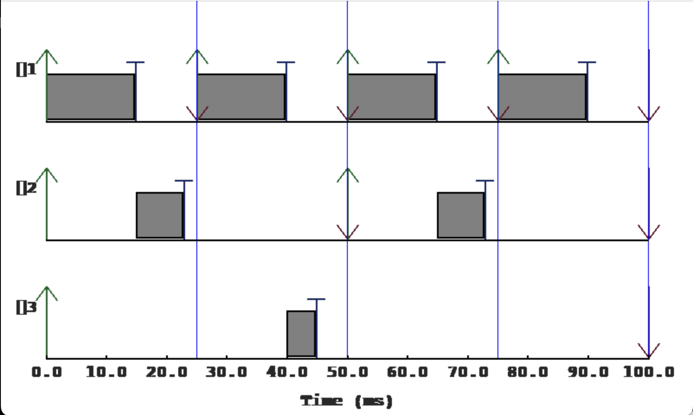
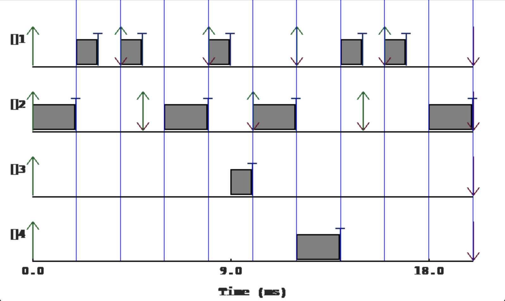
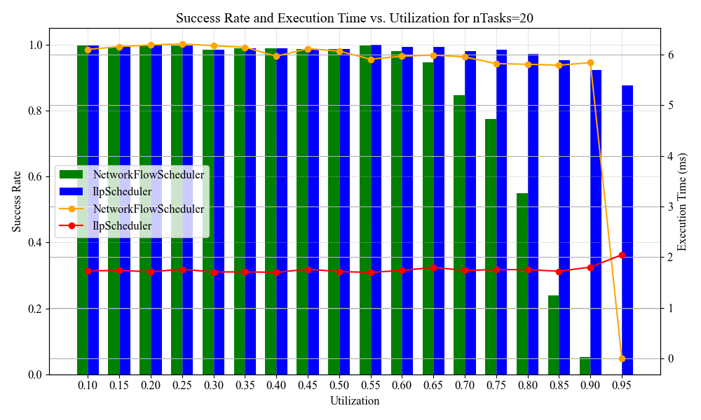
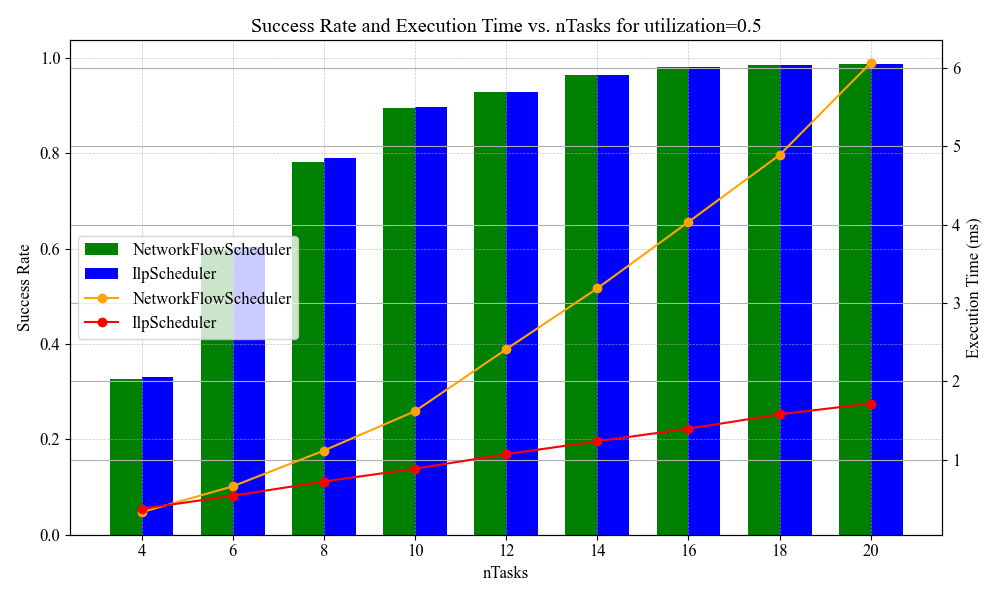

# Job Assignment in the Cyclic Executive Model

This repository contains the final project for the **CS330 Intro to Real-Time Programming** course. The project addresses the job assignment issue within the cyclic executive model, offering both a network flow approach (using the Edmonds-Karp algorithm) and an integer linear programming (ILP) approach to generate job assignments.

## Overview

The project workflow is as follows:
1. **Data Generation:**  
   Run `data_generation/generate_data.py` to create JSON files defining various tasksets.
2. **Job Assignment:**  
   - Run `flow.py` to generate job assignments and visualizations using the network flow method (Edmonds-Karp algorithm).  
   - Alternatively, run `ilp.py` to generate job assignments and visualizations using integer linear programming.
3. **Testing:**  
   Run `run_test.py` for different taskset sizes (specified by the `nTasks` parameter) to collect success rate and execution time data. Then, use the `consolidate_json_files()` function to merge all output JSONs into a single `data.json` file in the root directory.
4. **Visualization:**  
   Run `visualization.py` to visualize the combined data using the visualization module.

## Requirements

- **Python:** 3.12.8  
- **Environment Manager:** [Poetry](https://python-poetry.org/)  
- **Platform:** MacOS Sequoia v15.3.1 with an M2 chip

## Installation

1. **Install Poetry** (if not already installed):  
   Follow the instructions on the [Poetry website](https://python-poetry.org/docs/#installation).

2. **Clone the Repository:**
   ```bash
   git clone https://github.com/zlxlty/CS330_Final_Project.git
   cd CS330_Final_Project
   ```
3. **Activate the Virtual Environment**
   ```bash
   poetry shell
   ```
4. **Install Dependencies:**
   ```bash
   poetry install
   ```

## Usage
1. **Generate Taskset Data**  
   Change the `nTasks` parameter in the main section of `data_generation/generate_data.py` to the number of tasks you want in each taskset. Then, in the project's root directory run
   ```bash
   python data_generation/generate_data.py
   ```
   This will generate a `tasksets` folder containing a series of folder with name corresponds to the target total utilization of the tasksets. For example, `tasksets/0.5/18` will by default contain `400` jsons, each containing a taskset made up with 18 tasks with `0.5` total utilization. 
   ```json
   <!-- Example Taskset -->
   {
    "startTime": 0,
    "endTime": 72,
    "taskset": [
        {
            "taskId": 1,
            "period": 18,
            "wcet": 0.06855686808504463,
            "deadline": 18,
            "offset": 0
        },
        ...
        {
            "taskId": 18,
            "period": 12,
            "wcet": 0.21184690654352634,
            "deadline": 12,
            "offset": 0
        }
    ]
    }
   ```
   The utilization of each task is picked by UUniFastDiscard algorithm based on Simso's [implementation](https://github.com/MaximeCheramy/simso/blob/master/simso/generator/task_generator.py).  
   The period of each task is picked randomly from `PERIODS = [6, 12, 18, 24]` list.  
   [**IMPORTANT!**] Don't change the value of `PERIODS`. It's coupled with other magic numbers (mainly the frame size and major cycle length) in other parts of the program. Future revision might put `PERIOD` in a settings file. 
2. **Generate Job Assignments**  
   This program offers two job assignment algorithms.  
    **`Network Flow Approach`**  
    **Description:**  
    `flow.py` creates job assignments in two steps.  
    i) First, it will use Edmonds Karp Network Flow algorithm to create a preemptive job assignment. A visualization of such assignment will be stored in `output/flow_preemptive.png` with preempted job highlighted in `yellow`. If a job doesn't receive execution time equal to its WCET, its corresponding node will be marked in `red`.  
    ii) Then, we will store and remove preempted jobs from the previous assignment and try to fit each of them into a single frame using Best Fit Descend algorithm. If a fit is found, the modified flow graph will be stored in `output/flow_assigned.png`.  
    [**IMPORTANT!**] Step ii may fail to fit all jobs. In this case, the program will `sys.exit(1)`  
    **How To Run**:
    Auto-generated taskset might have too many nodes to visualize clearly. Hence, I recommend running hand-picked taskset `tasksets/ce_test1.json` or `tasksets/ce_test2.json` (will fail at step ii). To change what taskset to run, modify the `file_path` variable in the main section of `flow.py`. You do have to manually change the `frameSize` in `SchedulingDisplay` call to mark the correct frame size in the taskset scheduling chart. To run the program, simply use
    ```bash
    python flow.py
    ```
    You can expect a taskset scheduling chart similar to the following picture for `ce_test1` popping up on your screen.
      
    **`Integer Linear Programming Approach`**  
    **Description:**  
    Alternatively, you can use `ilp.py` to directly construct a non-preemptive schedule. It uses `gurobipy` integer linear programming [solver](https://pypi.org/project/gurobipy/) to find a feasible solution to the ILP corresponding to our job assignment problem.  
    **How To Use:**
    Similar to `flow.py`, simply use 
    ```bash
    python ilp.py
    ```
    to run the ilp algorithm.  
    For `ce_test2`, you show expect to see a schedule similar to the following:
      

3. **Run Experiments on Generated Tasksets** 
   Use `run_test.py` to run the aforementioned algorithms on all the tasksets generated in step 1. In the main section of run_test.py, add a call to `run_test(nTasks, [NetworkFlowScheduler, IlpScheduler])`, where `nTasks` specifies the number of tasks in the taskset you want to test. Each call will generate a result json file in the `output` folder with name similar to `NetworkFlowScheduler_0.85_18_results.json` with content like
   ```json
   {
    "Scheduler": "NetworkFlowScheduler",
    "nTaskSets": 400,
    "successCount": 88,
    "utilization": 0.85,
    "nTasks": 18,
    "totalTime": 0.4253927037352696
   }
   ```
   Here, `successCount` counts how many tasksets are scheduled successfully and `totalTime` sums up the execution time of all **successful attempts**.  
   Then, `consolidate_json_files()` will combine all json files you generated into a single `data.json` in the project's root directory.
   ```python
   python run_test.py
   ```

4. **Generate Data Visualization** 
   Finally, we can visualize the data in `data.json` in two different ways by using `visualization.py`.
   `success_rate_v_utilization(nTasks=20)` will generate the a graph similar to this:
     
   `success_rate_v_task_size(utilization=0.5, nTasks_values=range(20, 61, 10))` will generate the a graph similar to this:
     
   You can view more example visualizations in `example_output` folder.
   